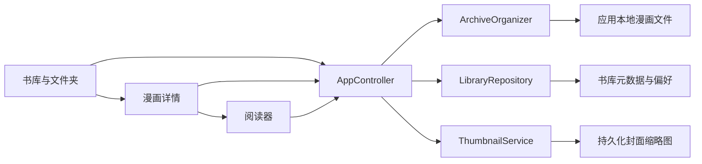

# 开源漫画阅读器调研与取舍

调研日期：2026-08-14

## 结论先行

漫匣最适合继续保持“小而专”的定位：Android ARM64、纯本地、WebP、导入后整理。成熟项目最值得借鉴的不是网络漫画源，而是阅读器手势、书库检索、数据备份和损坏修复。

建议按以下顺序演进：

1. 阅读器点击区域与手势防误触。
2. 书库搜索、筛选、排序和最近阅读。
3. 本地备份、恢复与书库完整性检查。
4. 重复导入检测、失败报告和重新扫描。
5. 自定义封面、改名和阅读器全局默认值。

暂不引入网络漫画源、账号、在线追踪、插件系统、服务端同步和大量格式支持。这些能力会明显增加包体、权限、维护成本和隐私风险，却偏离漫匣的核心用途。

## 当前模块地图

现有设计中值得保留的部分：

- 导入先写临时目录，成功后再整体移动，失败不会留下半本漫画。
- ZIP/CBZ 和文件夹共用自然排序、章节推断及安全限制。
- 阅读模式、进度和书签按漫画保存。
- 连续阅读按页面索引恢复位置，而不是依赖不稳定的像素偏移。
- 相邻页面预加载、缓存限制和持久化缩略图已经覆盖主要性能问题。

当前明显缺口：

- 书库没有搜索、阅读状态筛选、排序和最近阅读记录。
- 连续模式尚无可配置点击区域，也没有明确的“滚动优先”手势策略。
- 元数据集中存放，缺少可导出的版本化备份和完整性修复流程。
- 导入没有内容指纹，重复压缩包或重复文件夹会被再次复制。
- 书名和封面来源固定，用户不能改名或选择其他页面作为封面。

## 参考项目

### 1. Mihon

- 项目：[mihonapp/mihon](https://github.com/mihonapp/mihon)
- 状态：活跃，Android 原生，Apache-2.0。
- 已验证能力：本地阅读、多种阅读器与方向、书库分类、主题、本地备份。
- 值得借鉴：将阅读方向、缩放/适配、点击区域、预加载等收敛成一组阅读器设置；分类与备份作为书库基本能力。
- 不应照搬：在线源、扩展仓库、追踪网站、定时章节更新和来源迁移。
- 参考：[Reader settings](https://mihon.app/docs/guides/reader-settings)

### 2. Komikku

- 项目：[komikku-app/komikku](https://github.com/komikku-app/komikku)
- 状态：活跃，基于 Mihon/Tachiyomi 系，Apache-2.0。
- 已验证能力：隐藏分类、批量操作、继续阅读、书库搜索、Webtoon 自动识别、预加载与图片缓存配置。
- 值得借鉴：隐私模式与批量选择结合；大书库仍保持快速搜索；导入/恢复时用非阻塞进度横幅。
- 不应照搬：复杂搜索语法、自动联网推荐、多来源合并和大量派生设置。漫匣先做名称包含匹配和少量状态筛选即可。
- 参考：[Reader FAQ](https://komikku-app.github.io/docs/faq/reader)

### 3. YACReader

- 项目：[YACReader/yacreader](https://github.com/YACReader/yacreader)
- 状态：活跃，仓库主要是桌面版，GPL-3.0。
- 已验证能力：漫画库管理、ZIP/CBZ 等归档、搜索、数据库备份与恢复、封面修复、失败文件重新扫描。
- 值得借鉴：把“备份”和“修复”当作正式功能；损坏时保留原数据，再尝试恢复；排序结果跨页面保持一致。
- 不应照搬：桌面端界面、服务器浏览和数据库规模。漫匣可先使用版本化 JSON 清单和原子替换，不必立即引入重型数据库。
- 参考：[YACReader Features](https://www.yacreader.com/features)

### 4. Kavita

- 项目：[Kareadita/Kavita](https://github.com/Kareadita/Kavita)
- 状态：活跃，自托管服务端与 Web 客户端，GPL-3.0。
- 已验证能力：丰富的筛选/搜索、合集与阅读列表、阅读进度、Webtoon 和连续跨章节阅读。
- 值得借鉴：阅读状态作为一级筛选条件；章节结束后自然衔接；同一内容可用文件夹、合集等不同视角组织。
- 不应照搬：服务端、用户权限、元数据抓取、OPDS 和跨设备体系。它们不适合单机轻量应用。

### 5. Kotatsu

- 项目：[KotatsuApp/Kotatsu](https://github.com/KotatsuApp/Kotatsu)
- 状态：仓库已归档并停止支持，GPL-3.0。
- 已验证能力：阅读历史、书签、隐身模式、CBZ、本地离线、标准/Webtoon 阅读器和阅读手势。
- 值得借鉴：隐身阅读不写入历史；手势设置围绕单手操作设计；历史与书签分开表达。
- 不应照搬：任何在线源及同步能力，也不应依赖已停止维护的代码或组件。

### 6. OpenComic

- 项目：[ollm/OpenComic](https://github.com/ollm/OpenComic)
- 状态：活跃，Electron 桌面应用，GPL-3.0。
- 已验证能力：WebP/ZIP/CBZ、主文件夹、标签、日漫/Webtoon 模式、双页、书签、继续阅读、自定义点击区域和图像显示调整。
- 值得借鉴：点击区域可配置；滚动与翻页使用一致的阅读工具栏；亮度、对比度、反色等仅作用于阅读显示，不修改原图。
- 不应照搬：Electron 架构、远程协议、音频、PDF/EPUB 和长格式清单。手机端 WebP 专用是漫匣的优势。
- 参考：[OpenComic Guides](https://opencomic.app/docs/category/guides)

## 推荐路线

### P0：直接改善日常使用

#### 阅读器点击区域与防误触

- 默认中间区域显示/隐藏工具栏，两侧区域只在左右翻页模式中前进或后退。
- 连续模式以纵向滚动为最高优先级；发生明显位移后，本次触摸不得再触发点击翻页或工具栏动作。
- 页面位置按“页面索引 + 页面内相对位置”表达；进度在滚动稳定后节流保存，避免重建期间反复写入。
- 提供“点击区域预览”，但保持三个简单预设即可，不做任意网格编辑器。

#### 书库查找与最近阅读

- 名称搜索。
- 按导入时间、名称、最近阅读、阅读进度排序。
- 筛选：未开始、阅读中、已读、有书签、已隐藏。
- 首页单独保留一行最近阅读，不新增复杂动态信息流。

### P1：提高数据可靠性

#### 备份、恢复与修复

- 导出带版本号的 JSON 清单，包含书名、章节、进度、书签、文件夹、隐私设置和相对文件路径。
- 恢复前校验版本与文件存在性；恢复失败时不覆盖当前书库。
- 完整性检查扫描缺失页面、失效封面、残留临时目录和未被索引的漫画目录。
- 修复动作分项展示，默认不删除无法识别的数据。

#### 重复导入与失败恢复

- 第一层用页数、总大小和规范化文件名快速判断疑似重复。
- 仅对疑似重复项计算内容哈希，避免每次导入都做昂贵校验。
- 用户可选择跳过、仍然导入或替换；替换必须保留阅读进度和书签。
- 导入失败显示具体文件及原因，并允许从头重试；不尝试续写半成品目录。

### P2：体验增强

- 选择任意漫画页作为封面，并支持改名。
- 全局阅读器默认值，同时允许单本漫画覆盖。
- 页码滑杆配缩略图预览；缩略图按需生成并受缓存上限约束。
- 阅读显示调整：亮度、对比度、灰度、反色。只用 GPU/颜色滤镜显示，不重写 WebP 文件。
- 横屏双页作为可选模式，手机竖屏不主动启用。

## 明确不做

- 网络漫画源、爬虫和扩展仓库。
- 在线账号、追踪网站和社交功能。
- 自建同步服务器或多人权限系统。
- 为追求格式数量引入 PDF、EPUB、RAR、7Z、音频和远程文件协议。
- 自动联网抓取封面、简介或标签。
- 在书库规模尚未证明需要前引入服务端式数据库架构。

## 许可证边界

本调研以功能和交互行为为参考，建议在 Flutter 中独立实现，不直接复制外部项目源码。

- Mihon、Komikku 使用 Apache-2.0；若复制源码仍需保留许可证及归属说明。
- YACReader、Kavita、Kotatsu、OpenComic 使用 GPL-3.0；除非漫匣明确采用兼容 GPL 的发布方式，否则不要复制或移植其源码。
- 漫匣当前仓库未发现 `LICENSE` 文件。公开仓库不等于允许他人复用；若准备正式开源，应单独确定许可证后再处理代码引用。

